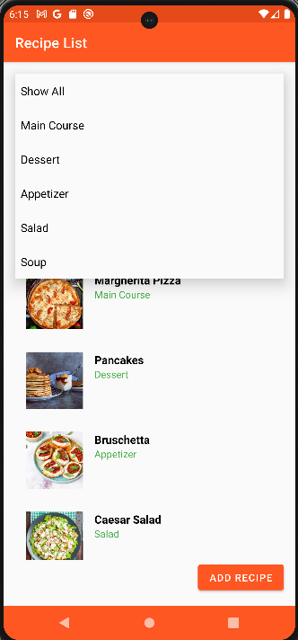

# RecipeApplication

RecipeApplication is an Android application that allows users to manage their personal recipes. Users can add new recipes with images, view a list of their recipes, and explore random meal suggestions using data fetched from an external API. The app uses Firebase Authentication for user management and Firebase Realtime Database for storing user-specific data like their name. It also utilizes Glide for image handling and Retrofit for API requests.

## Features

### User Authentication:
- Users can register and log in using their email and password via Firebase Authentication.
- After logging in, a personalized welcome message with the user’s name is displayed on the main screen.

### Recipe Management:
- Users can add recipes with a name, ingredients, steps, and images.
- Recipes are saved locally on the device for persistence, with images stored in internal storage.
- Recipes can be updated or deleted, and changes are reflected immediately.

### Random Meal Explorer:
- Users can explore random meals from an external API (TheMealDB).
- Each meal contains details such as the name, ingredients, instructions, and an image.

### Data Persistence:
- Recipes are stored as JSON in the internal storage for easy retrieval even after the app is restarted.
- Firebase is used for saving user data (e.g., the user’s name).

## Screenshots

### 1. Login Screen


### 2. Register Screen


### 3. Main Screen (Personalized Welcome)


### 4. Recipe List


### 5. Add Recipe Screen


### 6. Recipe Detail Screen


### 7. Random Meal Explorer


## Tech Stack
- **Language**: Kotlin
- **Architecture**: MVVM (Model-View-ViewModel)
- **UI Framework**: Jetpack ConstraintLayout, RecyclerView
- **Networking**: Retrofit, Gson
- **Image Loading**: Glide
- **Firebase**: Firebase Authentication, Firebase Realtime Database
- **Asynchronous Operations**: Kotlin Coroutines

## Getting Started

Follow these instructions to get a copy of the project up and running on your local machine for development and testing purposes.

### Prerequisites
- Android Studio (latest version)
- Firebase account for setting up Firebase Authentication and Realtime Database

### Installation

1. Clone the repository:
    ```bash
    git clone https://github.com/Jusnin/RecipeApplication.git
    cd RecipeApplication
    ```

2. Open the project in Android Studio.

3. Firebase Setup:
    - Add your Firebase project configuration (google-services.json) to the app/ directory.
    - Enable Firebase Authentication and Realtime Database in your Firebase console.
    - Update the Firebase rules to allow read and write access.

4. Run the app:
    - Once the Firebase setup is done, you can build and run the project on an emulator or a real device.

## Usage

### 1. User Registration:
- Launch the app and register a new user.
- After successful registration, the user will be logged in automatically, and the main screen will display a personalized welcome message.

### 2. Recipe Management:
- Users can add new recipes with images, ingredients, and steps.
- Recipes are displayed in a list on the "Recipe List" screen.
- Clicking a recipe from the list will display its details, where the user can update or delete the recipe.

### 3. Random Meal Explorer:
- Users can explore random meals fetched from TheMealDB API.
- Meal details like name, ingredients, and cooking instructions are displayed along with an image.

## Key Components

### 1. Authentication with Firebase
- Firebase Authentication is used for user sign-in and registration.
- The user ID (uid) is used to fetch the user's personalized data from Firebase Realtime Database.

### 2. Recipe Management
- Recipes are stored locally in JSON format for persistence across sessions.
- The `RecipeAdapter` class handles displaying recipes in a `RecyclerView`.
- The `AddRecipeActivity` allows users to add new recipes with images, ingredients, and steps. Images are stored in internal storage.

### 3. Random Meal Explorer
- The `RandomMealActivity` fetches random meals from TheMealDB API using Retrofit.
- Meals include detailed information such as ingredients, instructions, and an image, which are displayed in the UI using Glide.

### 4. Data Persistence
- Recipes are saved to internal storage in JSON format using Gson for easy serialization and deserialization.
- Firebase Realtime Database is used to store and retrieve the user’s name, which is displayed in the welcome message on the main screen.

## Code Structure

- **Packages**:
    - `adapter`: Contains `RecipeAdapter` for displaying recipes in a RecyclerView.
    - `model`: Contains the data models (Recipe, RecipeTypes, and MealDbResponse).
    - `network`: Contains Retrofit API client (`RetrofitClient` and `TheMealDbApi`).
    - `repository`: Contains `RecipeRepository`, which handles recipe data operations.
    - `ui.theme`: Manages the app's theme, color, and typography styles.
    - `view`: Contains the Activities for UI interactions (`MainActivity`, `AddRecipeActivity`, `RecipeListActivity`, `RandomMealActivity`, etc.).
    - `viewmodel`: Contains the `RecipeViewModel` which is responsible for managing the recipe data and UI logic.

## Contributing

Feel free to open issues or submit pull requests for improvements and bug fixes.
